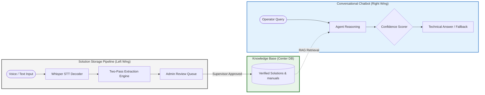
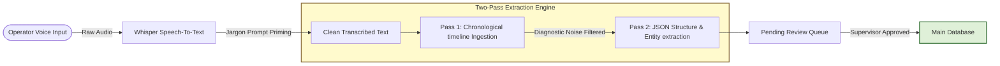
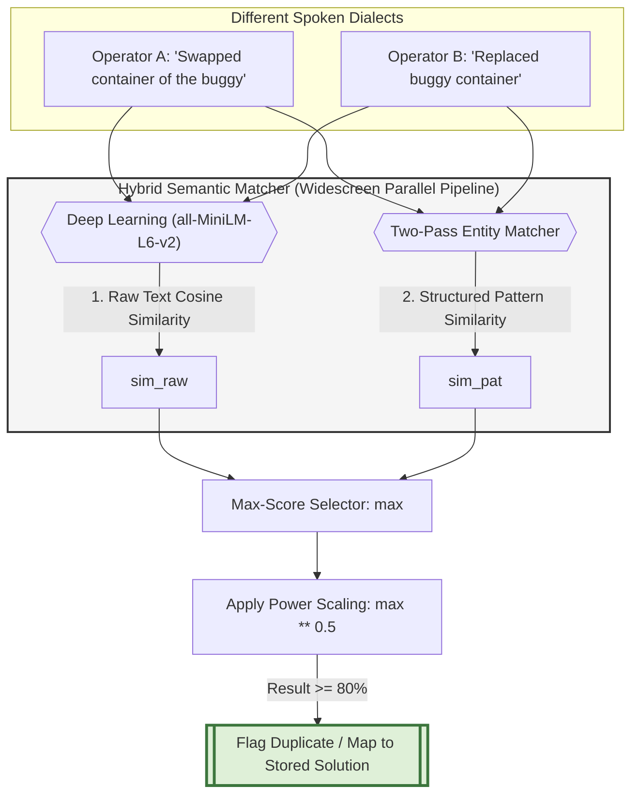
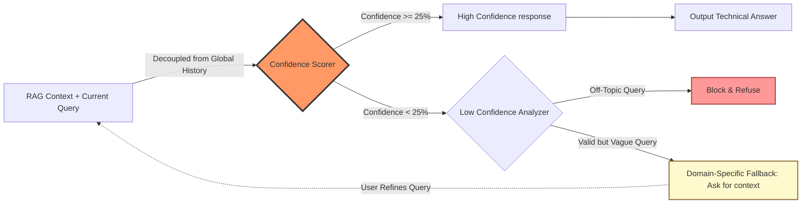
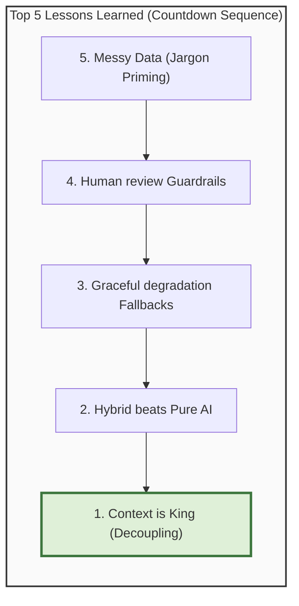
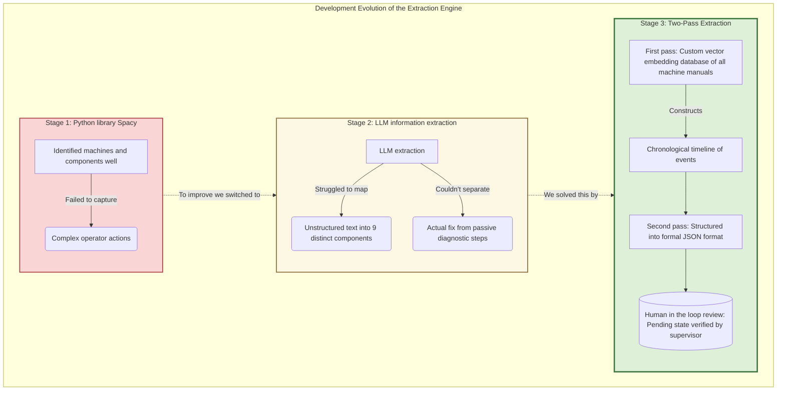
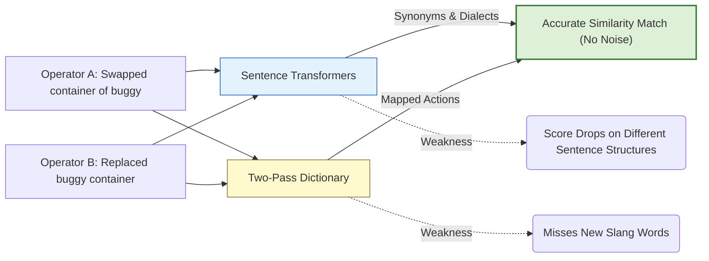
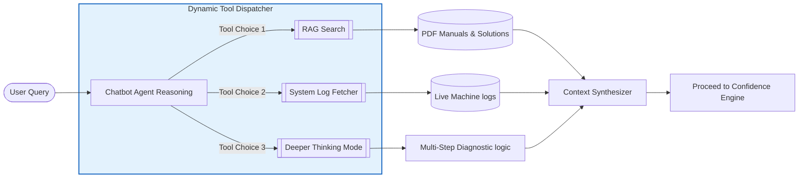

# Technical Challenges Presentation Draft


## Slide 1: Technical challenges

**Spoken Text:**
"Now I'm going to walk you through the technical challenges that we faced. There are 3 big components to our project. I will first talk about the solution storage where operators can document a solution to a machine issue that they fixed using voice or text and then the industrial chatbot where operators can ask all kinds of different questions about the machines to help them diagnose issues faster. Afterwards, Senne will walk you through the challenges of our preventive maintenance component. 

---

## Slide 2: Challenge 1 - Solution Storage & Information Extraction

**Spoken Text:**
"Let's start with Solution Storage. Our first challenge was converting raw voice input into text. While we used the OpenAI Whisper platform for basic speech-to-text, this is too general and not good enough for a noisy industrial setting where domain jargon would often get transcribed wrong. We solved this by first loading a custom Jargon Prompt that acts as a cheat sheet for Whisper's transcription, helping it to recognize specific industrial terminology like machine names and components. 
However, getting the correct raw text was only a small part of the challenges. Now we needed to extract the necessary information out of this text. To do this, the component evolved into three different stages.

Initially we tried a python library called Spacy, specialized for industrial entity extraction. It identified machines and components well, but completely failed to capture complex operator actions. To improve this we switched over to LLM information extraction, which worked quite well in the beginning. But after testing we noticed that this LLM struggled to map the unstructured text into 9 distinct components. Crucially, it couldn't separate the actual fix from passive diagnostic steps like checking a sensor that was fine. We solved this by developing a 'Two-Pass Extraction' architecture where we split the information extraction up into 2 different steps. 
The first pass queries a custom vector embedding database of all machine manuals to construct a true chronological timeline of events that filters out diagnostic noise. Then in the second pass everything gets structured into a formal JSON format that clearly captures everything that was done on which components. This also gets paired with 3D models and images of machine parts that can get added to the solution for extra information.

Lastly, because we couldn't just dump AI-extracted solutions directly into the database since this would become very unstructured very fast. We also built a human in the loop review workflow, where solutions are temporarily held in a pending state until they get verified by an supervisor."

---

## Slide 3: Challenge 2 - Dialect & Semantic Similarity

**Spoken Text:**
A second big challenge in this component was handling the different dialects and wordings which is very important to prevent the system from getting full with same solutions being explained in different wordings. If one operator explains a fix as 'Swapped the container of the buggy' and another says 'Replaced buggy container', then keyword matching would fail. We solved this by building a Hybrid system where we use a deep learning model called Sentence Transformers that converts the raw text into vector embeddings and calculates the Cosine Similarity based on concept and meaning. This naturally maps synonyms and dialects close together. However, the problem with this is that sentence structures in solutions can become so different that the comparison score can drop a lot. This is why we run a parallel check using our Two-Pass Extraction architecture. Here, different words like 'swap', 'replace', 'change' get mapped to the same action. The weakness of this second part is that new slang words that are not in the dictionary might fail to get extracted. But by combining it with the deep learning brain of Sentence Transformers and calculating both scores, we can get highly accurate similarity matching that understand the sentence context while simultaneously stripping away all unneccesary noise.

## Slide 4: Challenge 3 - RAG Pipelines and Agentic Tool Use


**Spoken Text:**
"Moving over to the Chatbot, the main technical difficulty here was that it isn't just a static conversational model. It acts as an intelligent agent. To ensure accuracy and to prevent AI hallucinations, we built a robust RAG pipeline. Instead of relying on the LLM's reasoning, we engineered it to actively retrieve verified solutions and machine manuals from our database. The true complexity here lies in the tool use. The chatbot dynamically decides when to execute a database search, when to look for previously stored solutions or when to activate a deeper "Thinking mode" for complex diagnostics. Getting the LLM to consistently use the right tools was a complex task and required careful prompt engineering to prevent the agent from hallucinating or getting stuck in loops. This paired with the live gathering of error logs and thus being able to filter out hundreds of unhelpful information logs made this a component that was invested a lot of time in to ensure the necessary accuracy.

---


**Spoken Text:**
"Even with RAG and tools, the AI sometimes fails to find a perfect match. Another big challenge was getting the chatbot to know when it *didn't* know the answer. We had to avoid two dangerous extremes of 'ghost confidence' and 'false refusals'.
Firstly, standard LLM's tend to carry over confidence from previous questions. This 'ghost confidence' can lead to the AI to confidently double down on wrong answers. We avoided this by decoupling the confidence scores from chat history and strictly basing them on the current query and the actual retrieved RAG data and tools used. 
Secondly, we had to prevent 'false refusals'. We had to differentiate: Is the operator asking an off-topic question, or are they asking a valid machine question that simply lacks database documentation?
We solved this by developing a multi-layered confidence algorithm. Instead of a flat refusal, it blocks off-topic queries, penalizes vague questions and guides the operator to provide more specific machine information to improve the next RAG search. 

"
---

## Slide 6: Top 5 Lessons Learned
**Visual Suggestion:** A clean, bold numbered list counting down from 5 to 1.

**Spoken Text:**
"To wrap up, here is our team's Top 5 technical lessons learned from building these components:

Probably the most important lesson learned is that CONTEXT IS KING, but so difficult to manage. Keeping an AI agent with a lot of different tools on track requires strict guidelines to prevent hallucinations and getting stuck in loops.
Second lesson: Hybrid engineering beats pure AI. We learned that relying solely on deep learning or pattenr matching is a recipe for failure. By stacking multiple methods together, it is possible to create actual robust engines that none of these systems could have achieved on their own. 


# Presentation Visuals

Here are the upgraded, PowerPoint-optimized **widescreen (16:9)** Mermaid diagrams. These have been designed with a horizontal left-to-right flow (`flowchart LR`) or balanced split grids so they fit beautifully on slide templates without looking squished or requiring vertical scrolling.

---

## Slide 1: Technical Challenges Overview
A left-to-right split architecture showcasing the two parallel pillars of your system connected to a shared database.



---

## Slide 2: Challenge 1 - Solution Storage & Extraction Pipeline
A sleek horizontal timeline detailing the three extraction stages, Jargon priming, and supervisor gating.



---

## Slide 3: Challenge 2 - Dialect & Semantic Similarity
A widescreen flow diagram showing the parallel Sentence Transformer vector math check and the Two-Pass Action Dictionary check working in tandem.



---

## Slide 4: Challenge 3 - RAG & Agentic Tool Use
A hub-and-spoke layout showing the AI Agent dynamically choosing between tools to construct a clean context.


---

## Slide 5: Challenge 4 - Chatbot Confidence & Fallbacks
A horizontal flow diagram showing how you avoid false refusals and decouple global history to eliminate ghost confidence.



---

## Slide 6: Top 5 Lessons Learned
A horizontal countdown sequence showing how your lessons flow together to build a robust system.




# Presentation Visuals

Here are the upgraded, PowerPoint-optimized **widescreen (16:9)** Mermaid diagrams. These have been designed with a horizontal left-to-right flow (`flowchart LR`) or balanced split grids so they fit beautifully on slide templates without looking squished or requiring vertical scrolling.

---

## Slide 1: Technical Challenges Overview
A left-to-right split architecture showcasing the two parallel pillars of your system connected to a shared database.


---

## Slide 2: Challenge 1 - Solution Storage & Extraction Pipeline
This widescreen diagram illustrates the three development stages of our extraction system, using only the exact terminology from your text.



---

## Slide 3: Challenge 2 - Dialect & Semantic Similarity
A widescreen flow diagram showing the parallel Sentence Transformer vector math check and the Two-Pass Action Dictionary check working in tandem.


---

## Slide 4: Challenge 3 - RAG & Agentic Tool Use
A hub-and-spoke layout showing the AI Agent dynamically choosing between tools to construct a clean context.


---

## Slide 5: Challenge 4 - Chatbot Confidence & Fallbacks
A horizontal flow diagram showing how you avoid false refusals and decouple global history to eliminate ghost confidence.


---

## Slide 6: Top 5 Lessons Learned
A horizontal countdown sequence showing how your lessons flow together to build a robust system.


# Presentation Visuals

Here are the upgraded, PowerPoint-optimized **widescreen (16:9)** Mermaid diagrams. These have been designed with a horizontal left-to-right flow (`flowchart LR`) or balanced split grids so they fit beautifully on slide templates without looking squished or requiring vertical scrolling.

---

## Slide 1: Technical Challenges Overview
A left-to-right split architecture showcasing the two parallel pillars of your system connected to a shared database.


---

## Slide 2: Challenge 1 - Solution Storage & Extraction Pipeline
This widescreen diagram illustrates the three development stages of our extraction system, using only the exact terminology from your text.


---

## Slide 3: Challenge 2 - Dialect & Semantic Similarity
This simplified, widescreen diagram illustrates how different operator dialects are matched, comparing the parallel Sentence Transformers and Two-Pass Dictionary paths using only your keyword terms.



---

## Slide 4: Challenge 3 - RAG & Agentic Tool Use
A hub-and-spoke layout showing the AI Agent dynamically choosing between tools to construct a clean context.



---

## Slide 5: Challenge 4 - Chatbot Confidence & Fallbacks
A horizontal flow diagram showing how you avoid false refusals and decouple global history to eliminate ghost confidence.


---

## Slide 6: Top 5 Lessons Learned
A horizontal countdown sequence showing how your lessons flow together to build a robust system.


# Presentation Visuals

Here are the upgraded, PowerPoint-optimized **widescreen (16:9)** Mermaid diagrams. These have been designed with a horizontal left-to-right flow (`flowchart LR`) or balanced split grids so they fit beautifully on slide templates without looking squished or requiring vertical scrolling.

---

## Slide 1: Technical Challenges Overview
A left-to-right split architecture showcasing the two parallel pillars of your system connected to a shared database.


---

## Slide 2: Challenge 1 - Solution Storage & Extraction Pipeline
This widescreen diagram illustrates the three development stages of our extraction system, using only the exact terminology from your text.


---

## Slide 3: Challenge 2 - Dialect & Semantic Similarity
This simplified, widescreen diagram illustrates how different operator dialects are matched, comparing the parallel Sentence Transformers and Two-Pass Dictionary paths using only your keyword terms.

```mermaid
flowchart LR
    A["Operator A: Swapped container of buggy"] --> C[Sentence Transformers]
    B["Operator B: Replaced buggy container"] --> C
    
    A --> D[Two-Pass Dictionary]
    B --> D
    
    C -->|Synonyms & Dialects| H["Accurate Similarity Match (No Noise)"]
    D -->|Mapped Actions| H
    
    C -.->|Weakness| E(Score Drops on Different Sentence Structures)
    D -.->|Weakness| F(Misses New Slang Words)
    
    style C fill:#e3f2fd,stroke:#1565c0,stroke-width:1px
    style D fill:#fffacd,stroke:#8a6d3b,stroke-width:1px
    style H fill:#dff0d8,stroke:#3c763d,stroke-width:2px
```

---

## Slide 4: Challenge 3 - RAG & Agentic Tool Use
This simplified, widescreen diagram illustrates how the intelligent agent dynamically decides which tools to execute, utilizing only key terms and short phrases from your text.

```mermaid
flowchart LR
    A[Operator Query] --> B[Intelligent Agent]
    
    B -->|Tool Choice: RAG Pipeline| C[Retrieve Verified Solutions & Machine Manuals]
    B -->|Tool Choice: Live Gathering| D[Error Logs]
    B -->|Tool Choice: Complex Diagnostics| E[Thinking Mode]
    
    C -.->|Prevents| F(AI Hallucinations)
    D -.->|Filters| G(Hundreds of Unhelpful Information Logs)
    E -.->|Prevents| H(Getting Stuck in Loops)
    
    C & D & E --> I[Ensure Accuracy]
    
    style B fill:#e3f2fd,stroke:#1565c0,stroke-width:1px
    style I fill:#dff0d8,stroke:#3c763d,stroke-width:2px
```

---

## Slide 5: Challenge 4 - Chatbot Confidence & Fallbacks
A horizontal flow diagram showing how you avoid false refusals and decouple global history to eliminate ghost confidence.

```mermaid
flowchart LR
    A[RAG Context + Current Query] -->|Decoupled from Global History| B{Confidence Scorer}
    
    B -->|Confidence >= 25%| C[High Confidence response]
    B -->|Confidence < 25%| D{Low Confidence Analyzer}
    
    C --> E[Output Technical Answer]
    
    D -->|Off-Topic Query| F[Block & Refuse]
    D -->|Valid but Vague Query| G[Domain-Specific Fallback: Ask for context]
    
    G -.->|User Refines Query| A
    
    style B fill:#f96,stroke:#333,stroke-width:3px
    style G fill:#fffacd,stroke:#8a6d3b,stroke-width:2px
    style F fill:#f99,stroke:#a94442,stroke-width:2px
```

---

## Slide 6: Top 5 Lessons Learned
A horizontal countdown sequence showing how your lessons flow together to build a robust system.

```mermaid
flowchart LR
    subgraph Lessons["Top 5 Lessons Learned (Countdown Sequence)"]
        L5["5. Messy Data (Jargon Priming)"] -->
        L4["4. Human review Guardrails"] -->
        L3["3. Graceful degradation Fallbacks"] -->
        L2["2. Hybrid beats Pure AI"] -->
        L1["1. Context is King (Decoupling)"]
    end
    
    style Lessons fill:#fafafa,stroke:#333,stroke-width:2px
    style L1 fill:#dff0d8,stroke:#3c763d,stroke-width:3px
```

